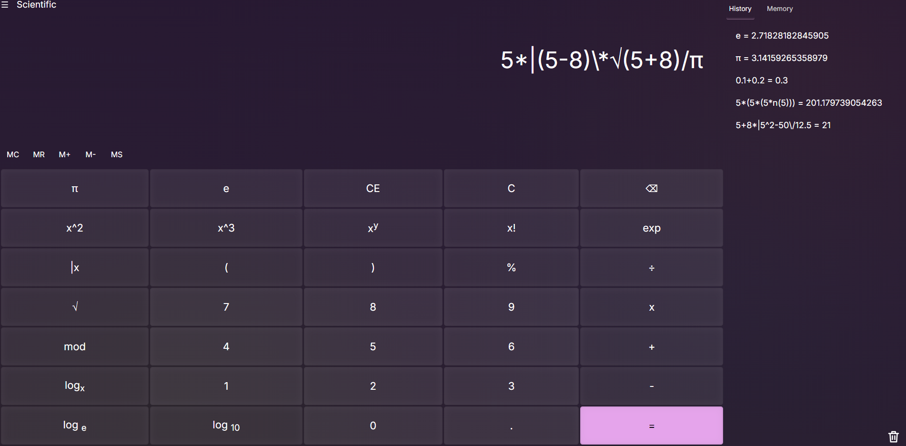

# Calculator 2.0

A feature-rich browser calculator built with **vanilla JavaScript, HTML, and SCSS**.

The project combines a standard and scientific calculator, date calculations, unit and currency converters, persistent history and memory, light and dark themes, and keyboard controls. Mathematical expressions are processed by a custom tokenizer and evaluator without using `eval()`.



## Live Demo

[Open Calculator 2.0](https://vlqdik.github.io/calculator-2/)

## Features

### Standard and scientific calculator

- Basic arithmetic: addition, subtraction, multiplication, and division
- Nested parentheses and operator precedence
- Powers, square roots, percentages, factorials, and modulo
- Absolute-value expressions
- Constants `π` and `e`
- Decimal logarithm, natural logarithm, and logarithm with a custom base
- Automatic completion of unfinished parentheses and absolute-value expressions
- Input validation and protection against invalid operator combinations
- Floating-point result correction for cases such as `0.1 + 0.2`
- Standard and scientific interface modes

### History and memory

- Calculation history
- Multiple independent memory entries
- Save, select, recall, update, and delete memory values
- History and memory are stored in `localStorage`
- Data remains available after the page is reloaded

### Date calculator

- Calculates the difference between two dates
- Displays years, months, and days
- Also displays the total number of days

### Converters

The project includes converters for:

- Time
- Distance
- Data size
- Volume
- Mass
- Area
- Speed
- Pressure
- Angle
- Energy
- Temperature
- Currency

Currency rates are loaded asynchronously from the public API at `https://open.er-api.com/`.

### Interface

- Light and dark themes
- Selected theme is stored in `localStorage`
- Keyboard controls
- Responsive layout for different screen sizes
- Side navigation for calculator modes and converters
- Adapted history and memory panels

## Keyboard Controls

| Key | Action |
| `0–9` | Enter numbers |
| `+`, `-`, `*`, `/`, `^` | Mathematical operators |
| `.`, `%`, `!` | Decimal point, percentage, factorial |
| `(`, `)` | Parentheses |
| `Enter` or `=` | Calculate result |
| `Backspace` | Delete the last character |
| `Delete` | Clear the current expression |

## Technical Highlights

- Custom expression tokenizer and evaluator written from scratch
- Recursive processing of nested parentheses and absolute-value expressions
- Mathematical priority handling without `eval()`
- Data-driven converter architecture with shared `toBase` and `fromBase` methods
- Asynchronous currency-rate loading with `fetch` and `async/await`
- Event delegation for dynamically rendered memory entries
- Persistent application state with `localStorage`
- Shared button logic for mouse and keyboard input

## Technologies

- HTML5
- SCSS / CSS3
- Vanilla JavaScript
- DOM API
- Fetch API
- LocalStorage
- CSS Grid and Flexbox

## Running Locally

No dependencies are required to run the compiled project.

1. Clone the repository:

```bash
git clone https://github.com/Vlqdik/calculator-2
```

2. Open the project directory:

```bash
cd calculator-2
```

3. Open `index.html` in a browser or launch it with a local development server such as Live Server.

To edit the SCSS source, compile it into the CSS file used by `index.html`.

## Project Purpose

Calculator 2.0 was created as a practice project focused on:

- Building non-trivial application logic with vanilla JavaScript
- Working with the DOM and browser events
- Designing a custom mathematical expression evaluator
- Managing persistent state
- Working with an external API
- Creating a responsive multi-mode interface

## Author

[Vlad](https://github.com/Vlqdik)
